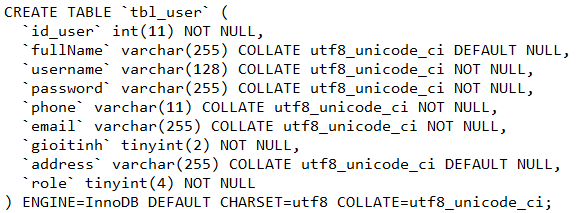
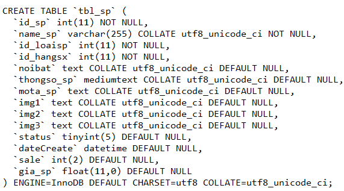
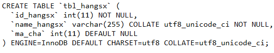
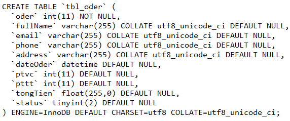
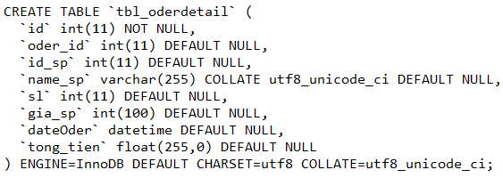
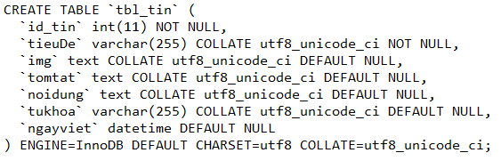
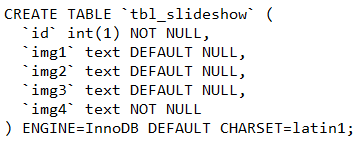
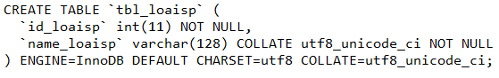
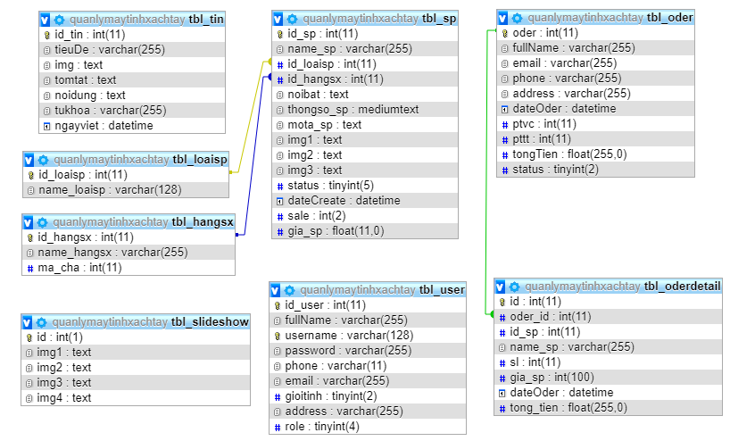

## Project: Xây dựng và quản lý trang web "Laptop chính hãng"
### 1. Tổng quan: 
Trang web được xây dựng bằng ngôn  ngữ PHP, HTML, CSS và JS. Nhằm mục đích giúp người mua và người bán dễ dàng thao tác hơn khi thực hiện mua bán online. 
Trang web có các chức năng cơ bản như đăng nhập, đăng ký thành viên, phân quyền chức năng giữa khách hàng và admin. Admin là người có quyền thao tác trên trang như thêm, sửa, xóa, cập nhật sản phẩm cũng như khách hàng. 
### 2. Cài đặt:
-Bước 1: Tạo database 
        
       +Tạo CSDL có tên là quanlymaytinhxachtay.sql trên PHP MyAdmin: http://localhost/phpmyadmin// 
        
       +Tạo các bảng trong CSDL như sau:
        
       
        
       
        
       
        
       
        
       
        
       
        
       
        
       
        
       Quan hệ giữa các bảng với nhau:
        
       
        
       Sau đó ta chèn dữ liệu cho các bảng
       
-Bước 2: Xây dựng chương trình: Trang web được viết trên Sublime Text, ngoài ra có thể viết trên một số phần mềm để xây dựng trang web khác như Dreamweaver, PHPdesigner,...
### 3. Link web demo: 
https://banlaptopchinhhang.000webhostapp.com/

